# Example Ink Sites

A list of sites using the SAPO Ink interface kit (http://ink.sapo.pt).

### SAPO Family
| Site | Screenshot |
| ---- | ---- |
| **SAPO24** http://24.sapo.pt/ |  |
| **SAPO Biz - Crie a sua loja online** http://biz.sapo.pt/ |  |
| **BlueStart** http://bluestart.pt/ |  |
| **Caiu na Rede** http://caiunarede.sapo.mz/ |  |
| **Carnaval 2014 - Moçambique - Página inicial** http://carnaval.sapo.mz/ |  |
| **Ink Interface Kit** http://ink.sapo.pt/ |  |
| **MEO Kanal** https://kanal.pt/ |  |
| **MEO Music** https://music.meo.pt/ |  |
| **SAPO Blogs template: Chocolate** http://blogs.sapo.pt/customize/preview/E14_Chocolate.bml | 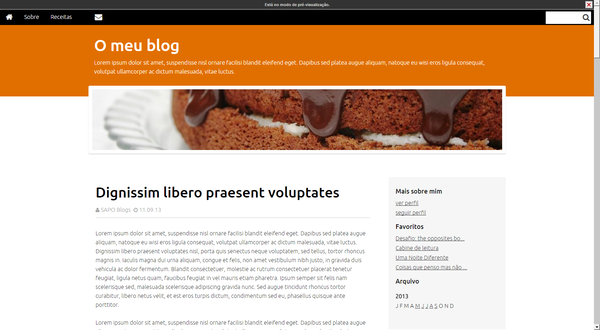 |
| **SAPO Blogs template: Clássico** http://blogs.sapo.pt/customize/preview/E14_Classico.bml |  |
| **SAPO Blogs template: Crafty** http://blogs.sapo.pt/customize/preview/E14_Crafty.bml |  |
| **SAPO Blogs template: Elevador** http://blogs.sapo.pt/customize/preview/E14_Elevador.bml |  |
| **SAPO Blogs template: Estilista** http://blogs.sapo.pt/customize/preview/E14_Estilista.bml | 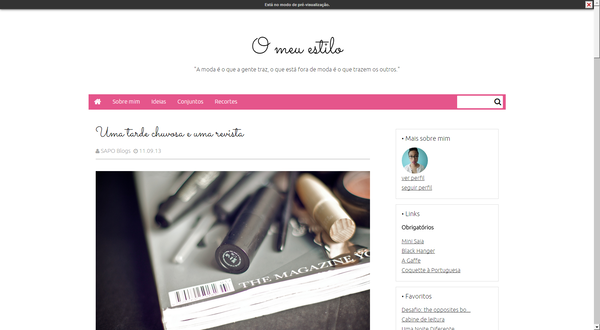 |
| **SAPO Blogs template: Horizonte** http://blogs.sapo.pt/customize/preview/E14_Horizonte.bml |  |
| **SAPO Blogs template: Livros** http://blogs.sapo.pt/customize/preview/E14_Livros.bml | 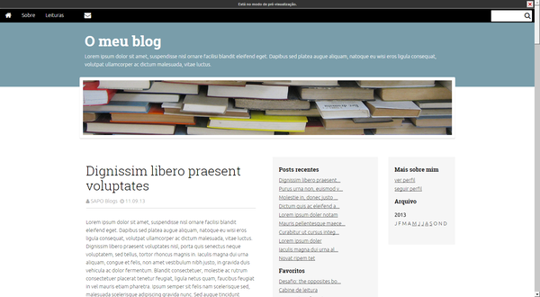 |
| **SAPO Blogs template: Da noite para o dia** http://blogs.sapo.pt/customize/preview/E14_Noitedia.bml | 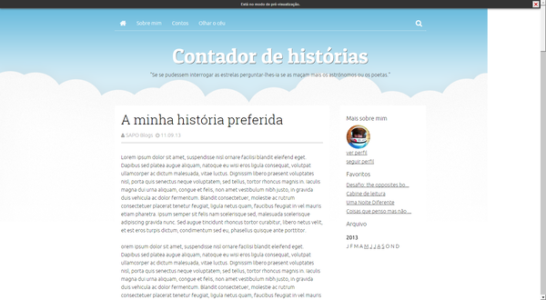 |
| **SAPO Blogs template: Tag** http://blogs.sapo.pt/customize/preview/E14_Tag.bml | 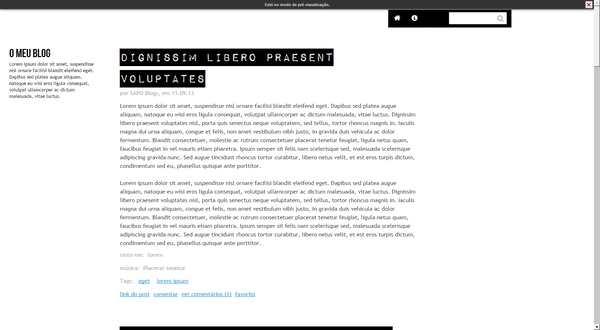 |
| **SAPO Blogs template: Beija-flor** http://blogs.sapo.pt/customize/preview/E15_Beija-flor.bml |  |
| **SAPO Blogs template: Blogzine** http://blogs.sapo.pt/customize/preview/E15_Blogzine.bml | 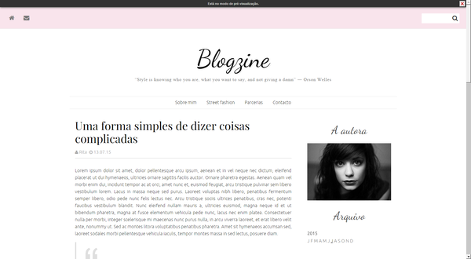 |
| **SAPO Blogs template: Coral** http://blogs.sapo.pt/customize/preview/E15_Coral.bml |  |
| **SAPO Blogs template: Galão** http://blogs.sapo.pt/customize/preview/E15_Galao.bml | 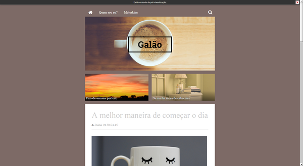 |
| **SAPO Blogs template: Listrado** http://blogs.sapo.pt/customize/preview/E15_Listrado.bml |  |
| **SAPO Blogs template: Marcapáginas** http://blogs.sapo.pt/customize/preview/E15_Marcapaginas.bml | 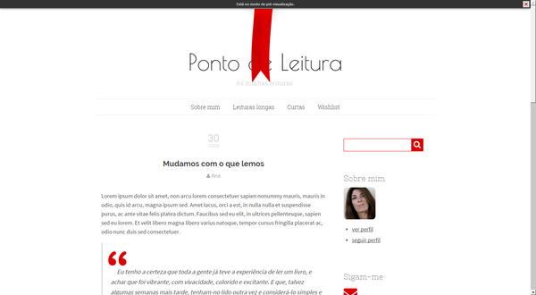 |
| **SAPO Blogs template: Mentalidade** http://blogs.sapo.pt/customize/preview/E15_Mentalidade.bml |  |
| **SAPO Blogs template: Mosaicos 2.0** http://blogs.sapo.pt/customize/preview/E15_Mosaicos2.bml |  |
| **SAPO Blogs template: Panorâmico** http://blogs.sapo.pt/customize/preview/E15_Panoramico.bml | 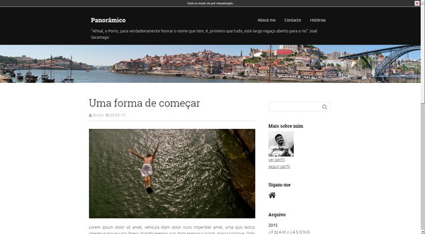 |
| **SAPO Blogs template: Sobrescrito** http://blogs.sapo.pt/customize/preview/E15_Sobrescrito.bml | 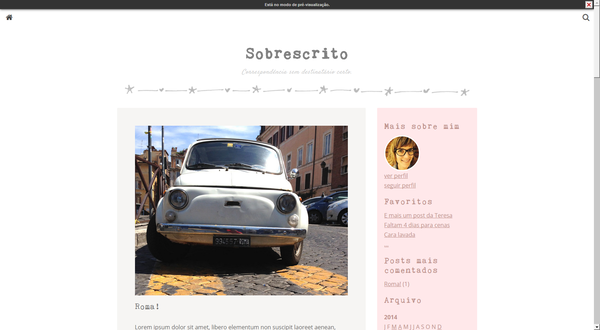 |
| **SAPO Blogs template: Vogue** http://blogs.sapo.pt/customize/preview/E15_Vogue.bml |  |
| **SAPO Blogs template: Hora de Ponta** http://blogs.sapo.pt/customize/preview/E15_horadeponta.bml |  |
| **SAPO Codebits 2014** https://codebits.eu/ | 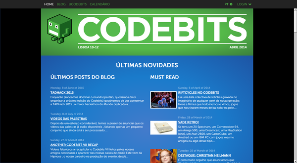 |
| **SAPO - Sobre o SAPO** http://sobre.sapo.pt/pt-pt |  |
| **SAPO Lifesytle** http://lifestyle.sapo.pt/ | 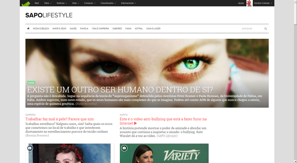 |
| **SAPO Promos** http://promos.sapo.pt/ |  |
| **SAPO Restaurantes** http://restaurantes.sapo.pt/ |  |

### Others
| Site | Screenshot |
| ---- | ---- |
| **Celso Martinho - Blog** http://celso.io/ |  |
| **Creche Maria Catita** http://crechemariacatita.pt/ |  |
| **obvious - um olhar mais demorado** http://obviousmag.org/ |  |
| **Fumaça Preta** http://fumacapreta.com/ |  |
| **Luís Carmona - Web Designer** http://luiscarmona.pt/ |  |
| **SINFO** http://sinfo.org/ |  |
| **Start playing! - Livebots** http://livebots.azurewebsites.net/ | 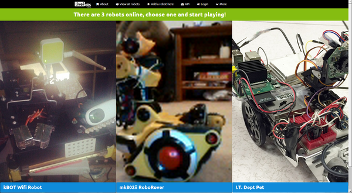 |
| **Sampaio da Nóvoa** http://www.sampaiodanovoa.pt/ | 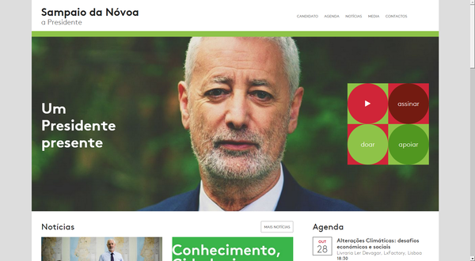 |

## Contribution Guidelines

- Make an individual pull request (or GitHub issue) for each suggestion.
- Verify the site is using *Ink*.  (Probably easiest to look for Ink specific classes, such as ```ink-grid```, in the source.)
- Use the following format, |``` TITLE + LINK | SCREENSHOT |```, where the title is the same as that on the home (or initial) page of the site.
- Include a screenshot of the site in the ```screenshots``` directory; and, ensure the screenshot is:
  - Saved as a PNG with the full domain name as the filename.  (If multiple sites appear under the same domain, as the case with the SAPO Blog templates, use the page filename as the image filename.
  - Resized to 600px wide and retains the same proportions as the original.
  - Contains the top of the home (or initial) page of the site and no window decoration or browser elements.
- Order sites alphabetically within the appropriate category.
